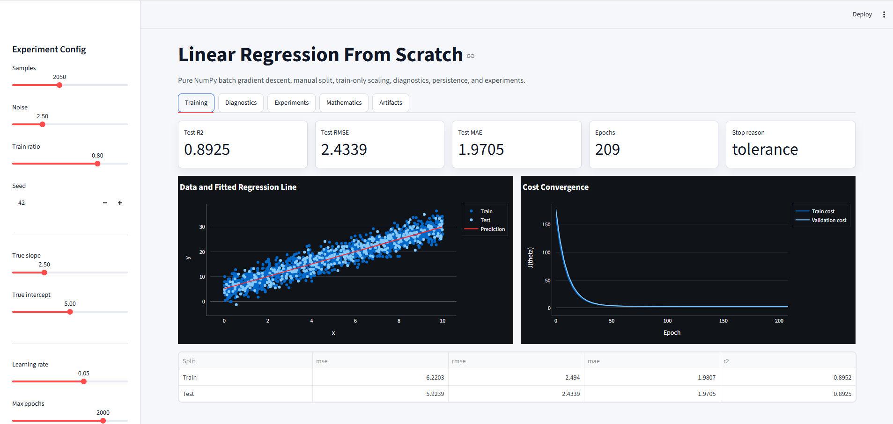
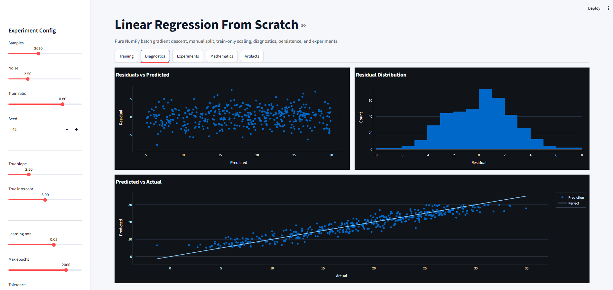
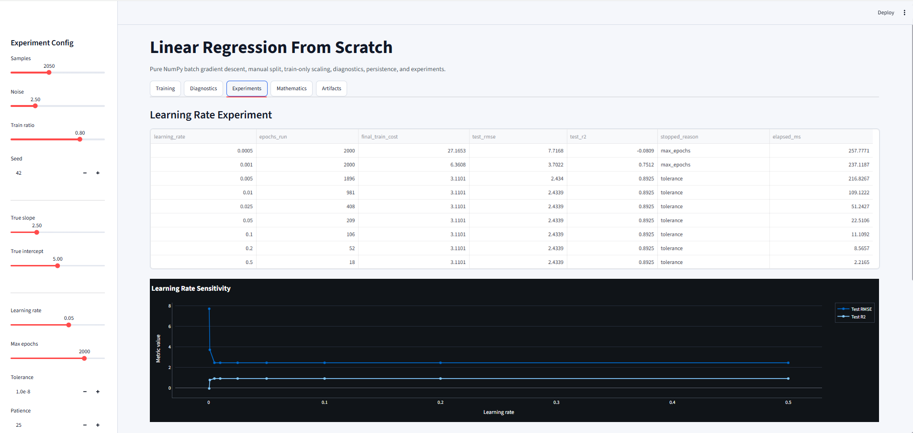
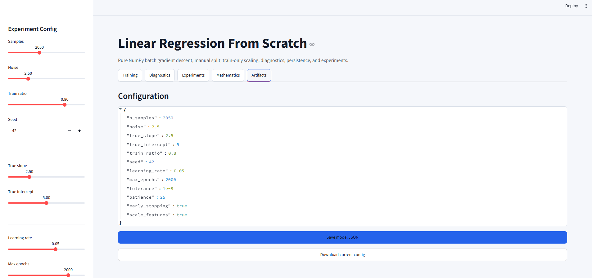

# Linear Regression From Scratch

> A production-style, no-scikit-learn implementation of Linear Regression using pure NumPy, built with a Streamlit dashboard, mathematical derivations, diagnostics, model persistence, tests, linting, type checking, benchmarking, and CI.


## Project Screenshots

Paste your screenshots here after running the app.

Recommended folder:

```text
docs/screenshots/
```

Dashboard screenshot:

```md

```

Diagnostics screenshot:

```md

```

Experiments screenshot:

```md

```

Example layout after adding images:

| Dashboard | Diagnostics |
|---|---|
|  |  |

| Experiments | Model Artifacts |
|---|---|
|  |  |

## What This Project Demonstrates

This project implements Linear Regression from first principles without scikit-learn. It is designed to show both mathematical understanding and engineering discipline.

Core goals:

- Derive and implement the Linear Regression objective manually.
- Train with vectorized batch gradient descent in NumPy.
- Use train/test split and train-only feature scaling.
- Analyze convergence, residuals, and learning-rate behavior.
- Save and load the trained model as JSON.
- Verify correctness with tests, linting, type checking, and CI.

## Key Features

- Pure NumPy implementation, no scikit-learn.
- Manual train/test split using a local NumPy RNG.
- Z-score scaling fit only on training data.
- Vectorized MSE cost and gradient calculation.
- Early stopping using tolerance and validation patience.
- Divergence detection for unstable learning rates.
- Metrics from scratch: MSE, RMSE, MAE, R2.
- Streamlit dashboard with light UI and dark-mode charts.
- Cost convergence visualization.
- Residual analysis and predicted-vs-actual plots.
- Learning-rate experiment table.
- Feature scaling comparison.
- Runtime benchmarking.
- JSON model save/load with scaler statistics.
- Config-driven reproducibility.
- Unit tests, edge-case tests, and Streamlit smoke test.
- Ruff linting, mypy type checking, and GitHub Actions CI.

## Demo App

Run the Streamlit dashboard:

```bash
streamlit run app.py
```

The app opens at:

```text
http://localhost:8501
```

Dashboard tabs:

- `Training`: metrics, fitted line, cost convergence.
- `Diagnostics`: residual plots and predicted-vs-actual analysis.
- `Experiments`: learning-rate sensitivity, scaling comparison, benchmark.
- `Mathematics`: objective, gradient, update rule, and stability notes.
- `Artifacts`: config display, JSON model save/load, config download.

## Quickstart

Clone the repository and install dependencies:

```bash
pip install -r requirements.txt
```

Run the app:

```bash
streamlit run app.py
```

Run command-line training:

```bash
python linear_regression_numpy.py --config config.json
```

Run benchmark:

```bash
python benchmark.py --config config.json --samples 100 500 1000
```

## Full Verification

Install development dependencies:

```bash
pip install -r requirements-dev.txt
```

Run the full quality gate:

```bash
python -m ruff check .
python -m mypy lr_scratch
python -m pytest
python linear_regression_numpy.py --config config.json --no-save
python benchmark.py --config config.json --samples 100 500 1000
```

Expected status:

```text
ruff:        PASS
mypy:        PASS
pytest:      15 passed
CLI:         PASS
benchmark:   PASS
```

## Mathematical Foundations

Given `m` training samples and `n` features, the model uses a design matrix `X` with a prepended bias column.

Prediction:

```text
y_hat = X theta
```

Half-MSE objective:

```text
J(theta) = (1 / 2m) * (X theta - y)^T (X theta - y)
```

The `1/2` factor is used because it cancels during differentiation.

Gradient:

```text
dJ/dtheta = (1 / m) * X^T (X theta - y)
```

Batch gradient descent update:

```text
theta := theta - alpha * (1 / m) * X^T (X theta - y)
```

Vectorized NumPy implementation:

```python
grad = (X.T @ (X @ theta - y)) / len(y)
theta = theta - learning_rate * grad
```

## Machine Learning Workflow

1. Generate a reproducible synthetic linear dataset.
2. Shuffle and split into train/test sets.
3. Fit z-score scaler on training features only.
4. Transform train and test features.
5. Train Linear Regression using batch gradient descent.
6. Stop on convergence, patience, max epochs, or divergence.
7. Evaluate train and test performance.
8. Analyze residuals and prediction quality.
9. Save model parameters and scaler stats to JSON.

## Project Structure

```text
linear_regression_app/
├── app.py                         # Streamlit dashboard
├── benchmark.py                   # Runtime benchmark entry point
├── config.json                    # Reproducible experiment config
├── linear_regression_numpy.py     # CLI training entry point
├── pyproject.toml                 # pytest, ruff, and mypy configuration
├── requirements.txt               # Runtime dependencies
├── requirements-dev.txt           # Test/lint/type-check dependencies
├── .github/
│   └── workflows/
│       └── ci.yml                 # GitHub Actions CI pipeline
├── lr_scratch/
│   ├── __init__.py
│   ├── config.py                  # Dataclass config + JSON loading
│   ├── data.py                    # Synthetic data + train/test split
│   ├── experiments.py             # Training, experiments, benchmarks
│   ├── metrics.py                 # MSE, RMSE, MAE, R2 from scratch
│   ├── model.py                   # LinearRegressionGD + JSON save/load
│   └── preprocessing.py           # Train-only z-score scaler
└── tests/
    ├── test_edge_cases.py         # Edge cases and failure modes
    ├── test_linear_regression.py  # Core math/model tests
    └── test_streamlit_smoke.py    # Launches Streamlit and checks localhost
```

## Configuration

Experiments are controlled through `config.json`:

```json
{
  "n_samples": 300,
  "noise": 2.5,
  "true_slope": 2.5,
  "true_intercept": 5.0,
  "train_ratio": 0.8,
  "seed": 42,
  "learning_rate": 0.05,
  "max_epochs": 2000,
  "tolerance": 1e-8,
  "patience": 25,
  "early_stopping": true,
  "scale_features": true
}
```

Invalid values are rejected early, including bad train ratios, non-positive learning rates, negative noise, and invalid epoch/patience settings.

## Example CLI Output

```text
Configuration
{
  "n_samples": 300,
  "noise": 2.5,
  "true_slope": 2.5,
  "true_intercept": 5.0,
  "train_ratio": 0.8,
  "seed": 42,
  "learning_rate": 0.05,
  "max_epochs": 2000,
  "tolerance": 1e-08,
  "patience": 25,
  "early_stopping": true,
  "scale_features": true
}

Learned parameters
[17.10050866  7.09480755]
epochs_run=209 stopped_reason=tolerance

Metrics
metric          train         test
----------------------------------
mse          6.454798     5.949160
rmse         2.540629     2.439090
mae          2.022737     1.950532
r2           0.886346     0.901895
```

Note: learned parameters are in scaled feature space when `scale_features=true`.

## Testing Strategy

The test suite checks:

- Gradient correctness against finite differences.
- Low-noise signal recovery.
- Reproducible train/test splits.
- Constant-feature scaling stability.
- First-principles metric correctness.
- JSON model save/load prediction equivalence.
- Invalid train ratios and shape mismatches.
- Constant-target R2 behavior.
- Divergent learning-rate handling.
- Learning-rate experiment output.
- Feature scaling comparison output.
- Noiseless near-perfect fit.
- Streamlit app startup on localhost.

Run tests:

```bash
python -m pytest
```

## CI/CD

GitHub Actions runs:

```text
ruff check
mypy type check
pytest
CLI smoke test
benchmark smoke test
```

CI file:

```text
.github/workflows/ci.yml
```

## Interview Talking Points

- Why `1/(2m)` in the cost function?
- Why gradient descent is sensitive to feature scale.
- Why scaling must be fit on train data only.
- How vectorized gradients avoid Python loops.
- How early stopping prevents wasted training.
- How residual plots reveal model misspecification.
- Why JSON persistence matters for inference workflows.
- Why tests for gradients are stronger than only checking final metrics.

## Known Limitations

- The default dataset is synthetic and one-dimensional.
- Linear Regression is intentionally simple and is used here to demonstrate fundamentals.
- The Streamlit smoke test verifies app startup, not pixel-level visual regression.
- No external real-world dataset is included by default.

## Resume Summary

Suggested resume bullet:

```text
Built a no-scikit-learn Linear Regression system in NumPy with vectorized gradient descent, train-only feature scaling, early stopping, residual diagnostics, learning-rate experiments, JSON persistence, benchmarking, pytest coverage, ruff/mypy checks, and GitHub Actions CI.
```

## License

This project is intended for educational and portfolio use.
